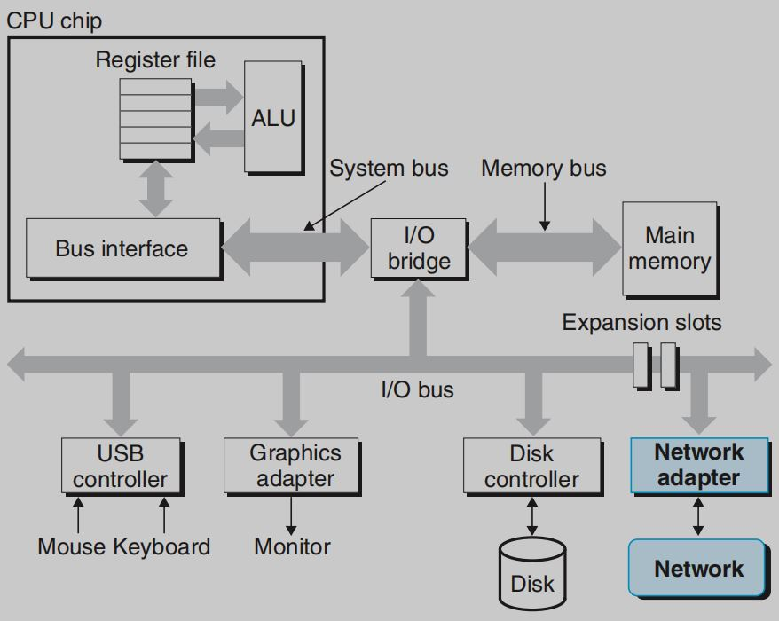
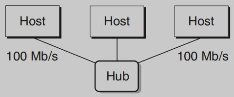
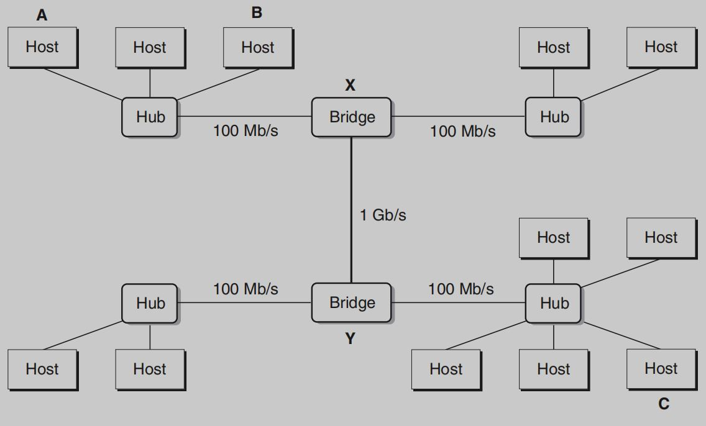
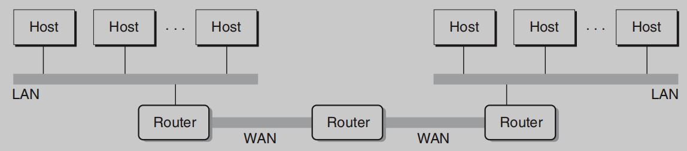
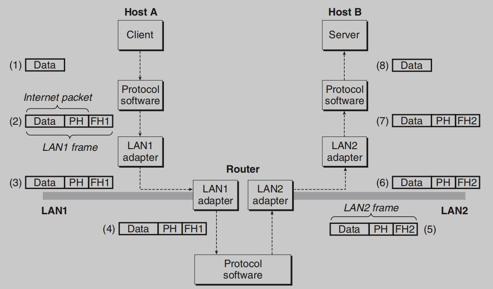
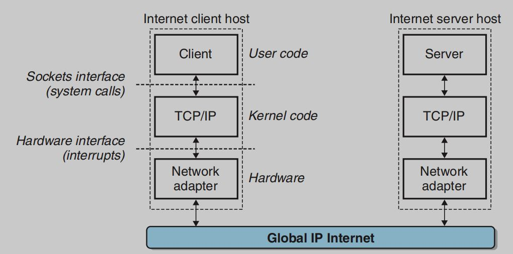
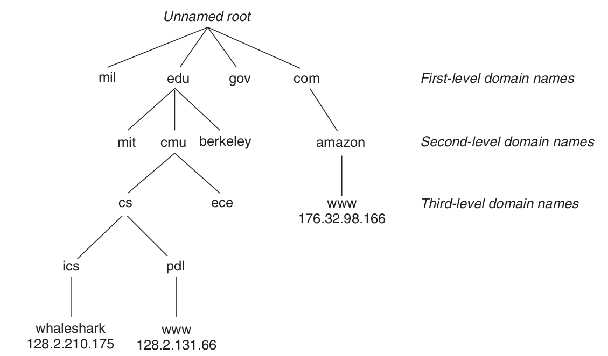
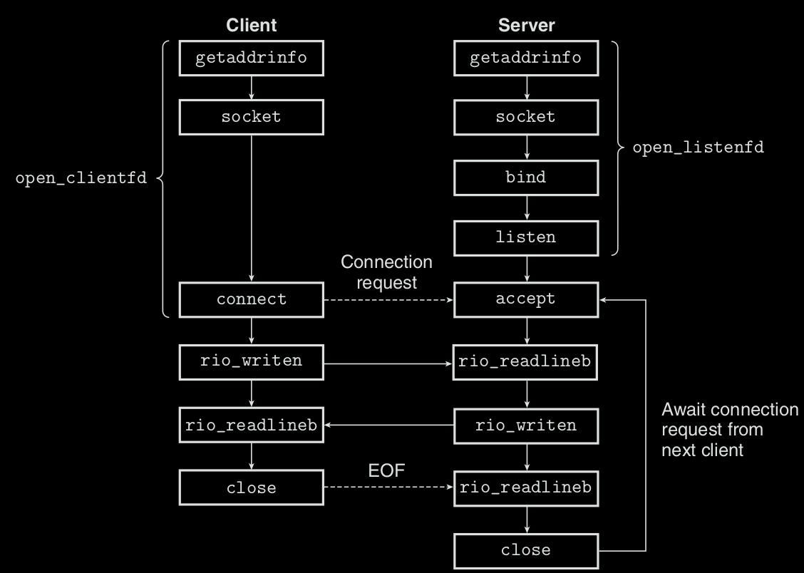
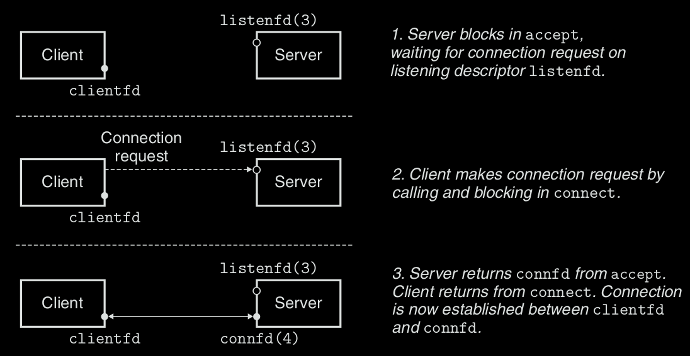

# 11.1 The Client-Server Programming Model
* Every network application is based on **Client-Server Programming Model**.
* In Client-Server Programming Model, an application consist of **a server process** and **one or more client processes**.
* A server manages some **resources** and it provides some **service** for clients by manipulating the resource.
* In Client-Server Programming Model, the fundamental operation is **transaction**.
* A Client-Server transaction consists of 4 steps:
  1. When a client need a service, it initiates a transaction by sending a request to a server.
  2. The server receives the request, interprets it, and manipulating its resources in the appropriate way (such as read a disk file, etc).
  3. The server sends a response to the client and wait for the next request.
  4. The client receives the response and manipulate it (such as display it on screen, etc).
* Clients and servers are **processes** but **not** machines.
* A single host can run many different clients and servers **concurrently**.

# 11.2 Networks
* To a host, a network is just another I/O device that serves as a source and sink for data.

* The most popular LAN (Local Area Network) is **Ethernet**.
* An Ethernet segment consists of some **wire** (twisted pairs of wires) and a **hub**.

* Each Ethernet adaptor has a global **unique 48bit address** that is stored in a **nonvolatile** memory on the adaptor.
  * A host can send a chunk of bits called a **frame** to other host on the memory.
  * Each frame includes **header** bits that identify **source** and **destination** of the frame and the **length** of the frame, then a payload of **data** bits.
  * Every host adaptor sees the frame, but **only** the destination host reads it.
* Multiple Ethernet segments can be connected to the larget LANs, called **bridged Ethernets**, using sets of wires and small boxes called **bridges**.

* At a higher level in the hierarchy, multiple incompatible LANs can be connected by specialized computers called **Routers** to form an **internet**
* Routers can also connect high-speed point-to-point phone connections which is WANs (Wide Area Networks).
* Routers can be used to build internets from arbitrary collections of LANs and WANs. 

* How to send data from one host to another destination of host across all incompatible networks? 
  * Protocol software that is running on each host and router.
  * Protocol must provide 2 basic capabilities:
    * Naming Scheme - assign each host an unique internet address.
    * Delivery Mechanism - bundle up data into **packets**.
      * A packet contains a **header** and a **payload**.
* Example:

  1. Client on host A invokes a **system call** to copy the data from client's virtual address space into a **kernel buffer**.
  2. **Protocol software** on host A creates a LAN1 frame by appending an **internet packet header (PH)** and **LAN1 frame header** to the data.
    * PH is addressed to internet host B.
    * FH is addressed to the router.
  3. LAN1 adaptor copies the frame to the network.
  4. The **router's LAN1 adaptor** receives the frame and passes it to the **protocol software**.
  5. Construct new frame:
     * The router get the destination internet address from PH.
     * The router use the destination address as an index to the router table to determine where to forward the packet.
     * The router strip off the old LAN1 header (FH) and append new LAN2 header addresses to host B.
     * The router pass the new frame to the adaptor.
  6. LAN2 adaptor receives the frame.
  7. The frame reaches host B. The adaptor pass it to **protocol software**.
  8. The protocol software strip off PH and FH. The protocol software will copy the data to the server's virtual address.

# 11.3 The Global IP Internet
* The basic hardware and software organization of an Internet client-server application:
  
* Each Internet host runs software that implements the **TCP/IP protocol (Transmission Control Protocol / Internet Protocol)**.
* Internet clients and servers communicate using a mix of **sockets interface functions** and **Unix I/O functions**.
* TCP/IP is actually a family of protocols.
* Datagrams: packets.
* UDP: unreliable datagram protocol.
* Internet Properties:
  * Hosts are mapped to **32bit IP addresses**.
    * IPv4 - 32bit address.
    * IPv6 - 128bit address.
  * IP Addresses are mapped to **Internet Domain Names**.
  * A process on one Internet host can communicate with a process on any other Internet host over a **connection**.
## 11.3.1 IP Addresses
* Network stores IP addresses in **IP address structure** below:
  ```
    struct in_addr{
        uint32_t    s_addr; /* Big-endian */
    }
  ```
* TCP/IP defines a uniform **network byte order** (big-endian byte order) for any integer data item.
* IP address format: **dotted decimal notation**.
  * 128.2.194.242 = 0x8002c2f2.
  ```
    linux> hostname -i  /* determine the dotted decimal address of your own host */
    128.2.194.242
  ```
  * Application program can convert back and forth between **IP addresses** and **dotted-decimal string**.
## 11.3.2 Internet Domain Names
* IP addresses map to **Domain Names**.
* The mapping is maintained in a distributed worldwide database known as **DNS (Domain Name System)**.
* Example - whaleshark.ics.cs.cmu.edu
  
  * First-level domain names:
    * Defined by ICANN (Internet Corporation for Assigned Names and Numbers) organization.
    * Includes com, edu, gov, org and net.
* Each Internet Host has the locally defined domain name **localhost**, which is always mapped to **loopback** address: 127.0.0.1.
  ```
    yd@ubuntu:~$ nslookup localhost
    Server:		127.0.0.53
    Address:	127.0.0.53#53

    Non-authoritative answer:
    Name:	localhost
    Address: 127.0.0.1
    Name:	localhost
    Address: ::1
  ```
* **'Hostname'** to determine the real domain name of the local host. **'nslookup'** to determine the localhost ip address:
  ```
    yd@ubuntu:~$ hostname
    ubuntu
    yd@ubuntu:~$ nslookup ubuntu
    Server:		127.0.0.53
    Address:	127.0.0.53#53

    Non-authoritative answer:
    Name:	ubuntu
    Address: 127.0.1.1
  ```
  ```
    yd@ubuntu:~$ nslookup www.baidu.com
    Server:		127.0.0.53
    Address:	127.0.0.53#53

    Non-authoritative answer:
    www.baidu.com	canonical name = www.a.shifen.com.
    Name:	www.a.shifen.com
    Address: 180.101.49.11
    Name:	www.a.shifen.com
    Address: 180.101.49.12
  ```
* Sometimes, multiple domain names are mapped to the same IP address.
## 11.3.3 Internet Connections
* A **connection** is point-to-point that it connects a pair of **processes**.
* A **socket** is an **end point** of a connection.
  * Each socket has a **socket address** consisting of an **Internet Address** and a **16bit integer port**.
  * The **port** in the **client**'s socket address is assigned automatically by the kernel, when a client make a request and is known as a **ephemeral port**.
  * The port in the **server**'s socket address is well-known port that is permanently associated with the service.
    * Web servers use port 80.
    * Email servers use port 25. 
  * The well-known service name for the Web service is aasociated with a well-know port.
    * Web service - http.
    * Email - smtp.
  * The mapping between well-known names and well-known ports is stored in a file (/etc/services).
* A connection is identified by **socket pair** (2 end-point socket addresses). Socket pair:
  * Format - **cliaddr:cliport, servaddr:servport**.
  * Example (Web client socket address):
    ```
      128.2.194.242:51213
    ```
    * Client address: 128.2.194.242.
    * Ephemeral port: 51213.
  * Example (Web server's socket address):
    ```
      208.216.181.15:80
    ```
    * Server address: 208.216.181.15.
    * Port: 80 - http/tcp.
  * Socket pair: (128.2.194.242:51213, 208.216.181.15:80).

# 11.4 The Socket Interface
* The **socket interface** is a set of **functions** that are used in with Unix I/O functions to build network application.
* _in means internet.

## 11.4.1 Socket Address Structures
```
  /* IP socket address structure */
  struct sockaddr_in {
  uint16_t  sin_family;     /* Protocol family (always AF_INET) */
  uint16_t  sin_port;       /* Port number in network byte order */
  struct in_addr sin_addr;  /* IP address  in network byte order */
  unsigned char sin_zero[8]; /* Pad to sizeof(struct sockaddr) */
  };
  
  /* Generic socket address structure (for connect, bind, and accept) */
  struct sockaddr {
  uint16_t sa_family; /* Protocol family */
  char  sa_data[14];  /* Address data */
  };
```
* For Linux kernel, a socket is **an end point for communication**.
* For Linux Program, a socket is an open file with descriptor.
```
  typedef struct sockaddr SA;
```
## 11.4.2 The **socket** Function
* Client and server use **socket function** to create **a socket descriptor**.
```
  #include <sys/types.h>
  #include <sys/socket.h>
  int socket(int domain, int type, int protocol);
```
* How to call socket:
  ```
    clientfd = socket(AF_INET, SOCK_STREAM, 0);
  ```
## 11.4.3 The **connect** Function
* A client establish a connection with a server by calling the **connect** function.
```
  #include <sys/socket.h>
  int connect(int clientfd, const struct sockaddr *addr, socklen_t addrlen);
  Returns: 0 if OK, −1 on error
```
* If the connection succeeds, the clientfd is ready for reading and writing.
* The resulting connection is characterized by the socket pair:
  ```
    (x:y, addr.sin_addr:addr.sin_port)
  ```
## 11.4.4 The **bind** Function
* **bind, listen and accept** are used for servers to establish connection with clients.
  ```
    #include <sys/socket.h>
    int bind(int sockfd, const struct sockaddr *addr, socklen_t addrlen);
    Returns: 0 if OK, −1 on error
  ```
  * **bind** function asks kernel to associate the server's **socket address in addr** with the **socket descriptor socketfd**.
  * Should use **getaddrinfo** to supply argument to bind.
## 11.4.5 The **listen** Function
* A server calls **listen** function to tell kernel that the socket will be used by a server instead of a client.
  ```
    #include <sys/socket.h>
    int listen(int sockfd, int backlog);
    Returns: 0 if OK, −1 on error
  ```
    * listen convert sockfd from an active socket to a **listening socket** that can accept connect request from clients.
## 11.4.6 The **accept** Function
```
  #include <sys/socket.h>
  int accept(int listenfd, struct sockaddr *addr, int *addrlen);
  Returns: nonnegative connected descriptor if OK, −1 on error
```
* Accept function:
  * Waits for a **connection request** from a client to arrive on listen descriptor **listenfd**.
  * **Fills** in client's socket descriptor in addr.
  * Returns a **connected** descriptor.
  
## 11.4.7 Host and Service Conversion
### The **getaddrinfo** function
* getaddrinfo converts strings of hostnames, host addresses, service names and port numbers into socket address structures.
  ```
    #include <sys/types.h>
    #include <sys/socket.h>
    #include <netdb.h>
    int getaddrinfo(const char *host, const char *service, const struct addrinfo *hints, struct addrinfo **result);
    Returns: 0 if OK, nonzero error code on error
    void freeaddrinfo(struct addrinfo *result);
    Returns: nothing
    const char *gai_strerror(int errcode);
    Returns: error message
  ```
    * 'result' points to a linked list of addrinfo structures which point to a socket address structure.
    * 'host' can be a domain name or a numeric address.
    * 'service' can be a service name or a decimal port number.
  ```
    struct addrinfo {
        int     ai_flags;       /* Hints argument flags */
        int     ai_family;      /* First arg to socket function */
        int     ai_socktype;    /* Second arg to socket function */
        int     ai_protocol;    /* Third arg to socket function */
        char    *ai_canonname;  /* Canonical hostname */
        size_t  ai_addrlen;     /* Size of ai_addr struct */
        struct sockaddr *ai_addr; /* Ptr to socket address structure */
        struct addrinfo *ai_next; /* Ptr to next item in linked list */
    };
  ```
    * ai_family: AF_INET=IPv4 address, AF_INET6=IPv6 address.
    * ai_socktype: SOCK_STREAM - restrict the list to **at most one addrinfo structure** for each unique address.
    * ai_flags: can use or to use various values at the same time.
      * AI_ADDRCONFIG: recommended if using connections.
      * AI_CANONNAME: instructs getaddrinfo to point the **ai_canonname field** in the **first** addrinfo structure in the list to the canonical (official) name.
      * AI_NUMERICSERV: force the service argument to be a port number.
      * AI_PASSIVE: instructs to return socket addresses that can be used by servers as **listening sockets**.
of host
### The **getnameinfo** Function
* getnameinfo is the inverse of getaddrinfo, which converts a socket address structure to host and service name strings.
```
  #include <sys/socket.h>
  #include <netdb.h>
  int getnameinfo(const struct sockaddr *sa, socklen_t salen, char *host, size_t hostlen, char *service, size_t servlen, int flags);
  Returns: 0 if OK, nonzero error code on error
```
  * The host or service name strings will be copies to 'host' or 'service'.
  * flags:
    * NI_NUMERICHOST: force getnameinfo to return a numeric address string as a domain name in host.
    * NI_NUMERICSERV: 
      * By default, getnameinfo will lookinto /etc/services and return a service name.
      * Setting NI_NUMERICSERV will force getnameinfo to return port number without looking into /etc/services.
## 11.4.8 Helper Function for the Sockets Interface
* Higher level helper function: open_clientfd, open_listenfd.
### open_clientfd
```
  #include "csapp.h"
    int open_clientfd(char *hostname, char *port);
    Returns: descriptor if OK, −1 on error
```
* A client **establishes a connection** with a server by calling open_clientfd running on host 'hostname' and listening for connection requests on port number 'port'.
* Codes:
  ```
    int open_clientfd(char *hostname, char *port)
    {
      int clientfd;
      struct addrinfo hints, *listp, *p;

      /* Get a list of server sock address structures */
      memset(&hints, 0, sizeof(struct addrinfo));
      hints.ai_socktype = SOCK_STREAM;  // return at most one addrinfo structure 
      hints.ai_flags = AI_NUMERICSERV;  // force the 'service' argument to be a port number
      hints.ai_flag |= AI_ADDRCONFIG;   // recommended if using connections
      getaddrinfo(hostname, port, &hints, &listp);  // get sock address structure 'listp'

      for(p = listp; p; p = p->ai_next)
      {
        // Create Socket. if socket function failed, continue next loop
        if((clientfd = socket(p->ai_family, p->ai_socktype, p->ai_protocol)) < 0)
          continue;

        // Connect to the server. If connect successfully, break the loop.
        if(connect(clientfd, p->ai_address, p->ai_addrlen)!=-1)
          break;
        close(clientfd);
      }

      Freeaddrinfo(listp);
      if(!p) return -1;
      else return clientfd; // return successful connect
    }
  ```
### open_listenfd
* A server creates a listening descriptor that is ready to recieve connection requests by calling open_listenfd function.
```
  int open_listenfd(char* port)
  {
    struct addrinfo hints, *listp, *p;
    int listenfd, optval=1;

    /* Get a list of potential server addresses */
    memset(&hints, 0, sizeof(struct addrinfo));
    hints.ai_socktype = SOCK_STREAM;
    hints.ai_flags  = AI_PASSIVE | AI_ADDRCONFIG; // be listening socket | recommend
    hints.ai_flags |= AI_NUMERICSERV; // force the 'service' argument to be a port number
    getaddrinfo(NULL, port, &hints, &listp);

    /* Walk through the address list and find the one to bind */
    for(p=listp;p;p=p->ai_next)
    {
      // Create a socket descriptor
      if((listenfd = socket(p->ai_family,p->ai_socktype,p->ai_protocol))<0)
        continue;

      setsockopt(listenfd, SOL_SOCKET, SO_REUSEADDR, (const void*)&optval, sizeof(int));
    }
  }
```


# Practical Problems
## Practical Problem 11.1
107.212.122.205:    0x68D47ACD
64.12.149.13:       0x400C950D
107.212.96.29:      0x6BD4601D
0.0.0.128:          0x00000080
255.255.255.0:      0xFFFFFF00
10.1.1.64:          0x0A010140
## Practical Problem 11.2
``` hex2dd.c
    
```