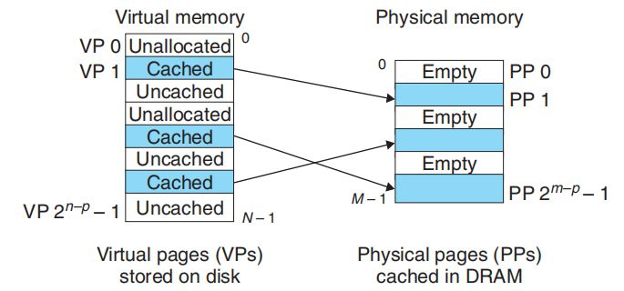
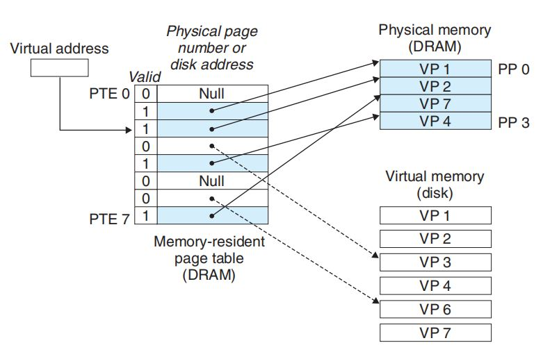
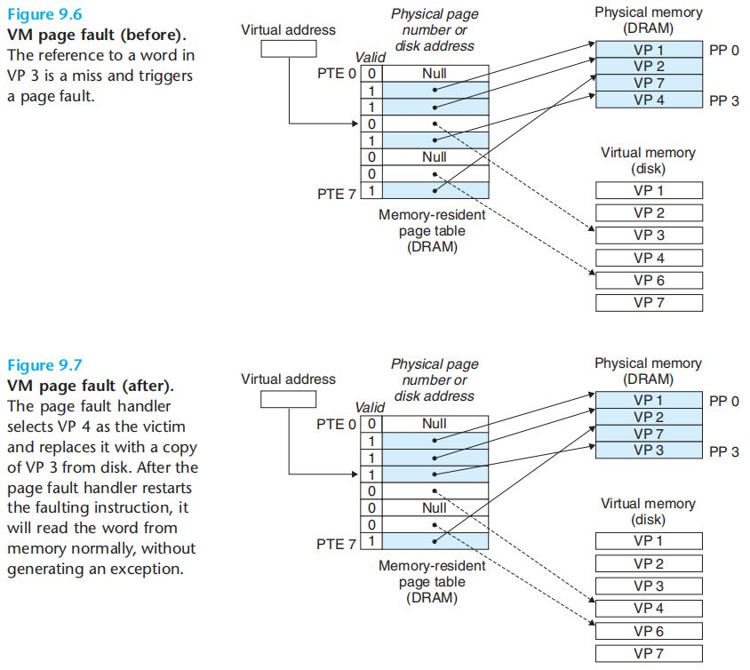

# 9.1 Physical and Virtual Addressing
* Address Tranlation - converting a virtual address to a physical address;
    * Dedicated Hardware - MMU (Memory Management Unit);

# 9.2 Address Spaces
* n-bit address space - a virtual address with N = 2(n) addresses;

# 9.3 VM as a Tool for Caching
* Virtual  pages (VPs);
* Physical pages (PPs, also called physical frames);
* 3 subsets of virtual pages:
    * unallocated - do not occupy disk space;
    * cached;
    * uncached;

## 9.3.1 DRAM Cach Organization
* size of a VP - 4kb to 2mb;
* About replacement algorithms, DRAM caches always use **write-back** instead of write-through;
* Suppose we write a word w that is already cached (a write hit):
  * Write-through: immediately write w’s cache block to the next lower level;
  * Write-back: defers the update when the updated block is **evicted** from the cache by the replacement algorithm.
  
## 9.3.2 Page Tables
* PTE - page table entries. Each PTE consists of a valid bit and an n-bit address field;

## 9.3.3 Page Hit

## 9.3.4 Page Faults

# Practice Problem
## 9.1 - 16 15 14 16K-1 24 16M 46 64T-1 4P 4P-1
## 9.2 - 2(4) 2(4) 2(3) 2(6)